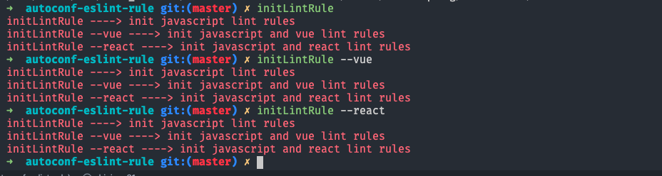

# autoconf-eslint-rule
eslint规则自动配置安装


## 初始化Lint插件

1. 第一步全局安装插件

```
npm install -g autoconf-eslint-rule
```

2.在需要配置eslit的项目目录执行 `initLintRule` 命令，该命令支持一下参数

`[不加参数]`  **基本的javascript开发规则**

`--vue`  **配置vue项目eslint规则**

`--react`  **配置react项目eslint规则**

### 命令实例


